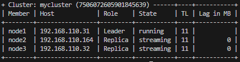
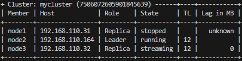

# Cấu hình High avaibility và Failover tự động
Ở bước trước, tôi đã hướng dẫn bạn [cài đặt và cấu hình replication](../install%20and%20replication/linux.md) cụm Postgresql trên linux với 3 node (master, slave_1, slave_2):
  + Địa chỉ ip master (node1): 192.168.110.31
  + Địa chỉ ip slave_1 (node 2): 192.168.110.32
  + Địa chỉ ip slave_2 (node 3): 192.168.110.164

Hướng dẫn này sẽ tiến hành cấu hình High avaibility (HA) và Failover tự động cho cụm trên.
## 1. TỔNG QUAN
Để đảm bảo hệ thống cơ sở dữ liệu luôn sẵn sàng, HA và Failover tự động là yếu tố then chốt. 
Mục tiêu của hướng dẫn này là tự động hóa quá trình phát hiện lỗi và chuyển đổi master, giúp hệ thống tự phục hồi mà không cần can thiệp. Chúng ta sẽ sử dụng:

- Patroni: Một hệ thống quản lý cluster PostgreSQL tự động xử lý failover, khởi tạo lại node, và quản lý vòng đời cụm.
- etcd: Kho lưu trữ khóa-giá trị phân tán mà Patroni sử dụng để lưu trữ trạng thái cluster và bầu chọn master.
Khi Patroni kết hợp với etcd, cụm PostgreSQL sẽ có khả năng tự động xử lý các sự cố, đảm bảo tính sẵn sàng cao nhất.

## 2. CÀI ĐẶT VÀ CẤU HÌNH HIGH AVAIBILITY
### 2.1. Cài đặt và cấu hình etcd
Patroni cần một nơi để lưu thông tin về cụm, và mình sẽ dùng etcd vì nó đơn giản và phổ biến. Giả sử bạn có 3 máy (node1, node2, node3), mình sẽ chạy etcd trên node1 để dễ triển khai.
#### 2.1.1. Trên node1 (192.168.110.31)
- Update gói: 
    ```bash
    sudo apt update
    ```

- Cài đặt etcd: 
    ```bash
    sudo apt install etcd
    ```

- Cấu hình etcd:
    + Mở file cấu hình `/etc/etcd/etcd.conf.yml`
        ```bash
        sudo vim /etc/etcd/etcd.conf.yml
        ```
    + Thêm nội dung sau (thay IP trong trường listen-client-urls và advertise-client-urls bằng IP của node1):
        ```text
        name: node1
        data-dir: /var/lib/etcd
        listen-client-urls: http://192.168.110.31:2379
        advertise-client-urls: http://192.168.110.31:2379
        ```
    + Khởi động etcd và bật khởi động cùng hệ thống:
        ```bash
        sudo systemctl start etcd
        sudo systemctl enable etcd
        ```
#### 2.1.2. Trên node2 và node3 (192.168.110.164 và 192.168.110.32)
Không cần cài etcd ở đây, chỉ cần đảm bảo hai node này có thể kết nối đến IP của node1 (ví dụ: 192.168.110.31:2379)

### 2.2. Cài đặt và cấu hình Patroni
Thực hiện lần lượt các bước dưới dây cho cả 3 node:
- Cài đặt:
    ```bash
    sudo apt install patroni
    ```
- Cấu hình:
    + Mở file cấu hình:
        ```bash
        sudo vim /etc/patroni.yml
        ```
    + Thêm nội dung sau (thay IP và tên node cho phù hợp theo hướng dẫn ở comment bên dưới):
        ```bash
        scope: mycluster
        name: node1  # Thay thành node2, node3 trên các máy khác

        restapi:
            listen: 0.0.0.0:8008
            connect_address: 192.168.110.31:8008  # IP của node này

        etcd3:
            hosts: 192.168.110.31:2379  # IP của node chạy etcd (node1)
            protocol: http

        bootstrap:
            dcs:
                ttl: 30
                loop_wait: 10
                retry_timeout: 10
                maximum_lag_on_failover: 1048576
                postgresql:
                    use_pg_rewind: true
                    parameters:
                        wal_level: replica
                        hot_standby: "on"
                        wal_log_hints: "on"

            initdb:
                - encoding: UTF8
                - data-checksums

            pg_hba:
                - host replication replicator 192.168.110.0/24 md5
                - host all all 0.0.0.0/0 md5

        postgresql:
            listen: 0.0.0.0:5432
            connect_address: 192.168.110.31:5432  # IP của node này
            data_dir: /etc/postgresql/14/main
            bin_dir: /usr/lib/postgresql/14/bin
            authentication:
                replication:
                    username: replicator
                    password: Finpros2023,
                superuser:
                    username: postgres
                    password: Finpros2023,
            parameters:
                archive_mode: "on"
                archive_command: "cp %p /var/lib/postgresql/14/archive/%f"
        ```
- Chỉ đinh file cấu hình mới cho Patroni khi khởi động:
    + Mở file `/etc/systemd/system/patroni.service`:
        ```bash
        sudo vim /etc/systemd/system/patroni.service
        ```
    + Sửa nội dung dòng `ExecStart`, thay path config cũ `/etc/patroni/patroni.yml` bằng path config mới `/etc/patroni.yml` 
    + Lưu thay đổi và tải lại Systemd:
        ```bash
        sudo systemctl daemon-reload
        ```
- Tạo thư mục archive và đổi quyền sở hữu:
    ```bash
    sudo mkdir -p /var/lib/postgresql/14/archive
    sudo chown postgres:postgres /var/lib/postgresql/14/archive
    ```
- Khởi động Patroni và bật khởi động cùng hệ thống:
    ```bash
    sudo systemctl start patroni
    sudo systemctl enable patroni
    ```
- Kiểm tra cụm Patroni:

    Trên bất kỳ node nào, chạy lệnh sau để xem trạng thái cụm:
            
    ```bash
    patronictl -c /etc/patroni.yml list
    ```
    Kết quả trả về trạng thái của cụm:

<div align="center">
    </img>
    <p>Check cluster patroni</p>
</div>
Kết quả là node1 đang là leader, node2 và node3 là các node replica ở trạng thái streaming. Như vậy là đã cài đặt và cấu hình xong cụm Postgresql HA gồm 3 node. Patroni kết hợp với etcd giúp cho cụm PostgreSQL có khả năng tự động xử lý các sự cố, đảm bảo tính sẵn sàng cao nhất

## 3. KIỂM TRA FAILOVER
- Stop Patroni trên node1:
    ```bash
    sudo systemctl stop patroni
    ```
- Kiểm tra cụm Patroni:
    ```bash
    patronictl -c /etc/patroni.yml list
    ```
    Kết quả trả về trạng thái của cụm:

<div align="center">
    </img>
    <p>Check cluster patroni</p>
</div>
Kết quả là trạng thái node1 dừng hoạt động, chuyển vai trò từ leader sang replica. node2 được bầu chọn làm leader, chuyển trạng thái từ streaming sang running. node3 giữ nguyên vai trò và trạng thái streaming. Như vậy là quá trình failover đã diễn thành công một cách tự động.
