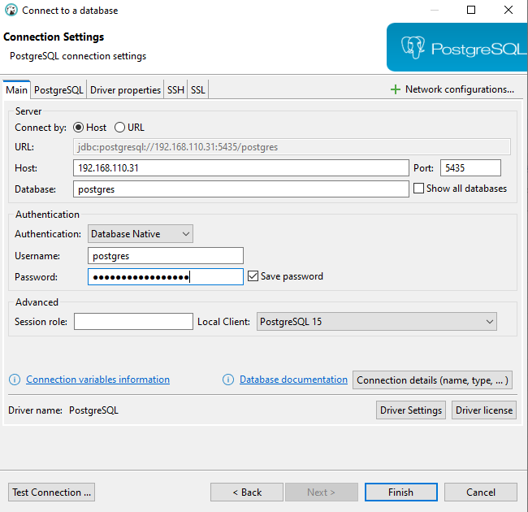
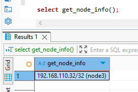
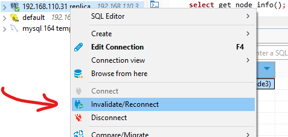
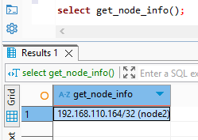

# Cấu hình Load balancer
## 1. TỔNG QUAN
Ở bước trước, chúng ta đã thiết lập [cấu hình High avaibility (HA) và failover tự động](../High%20avaibility%20and%20Failover/linux.md) sử dụng Patroni và etcd cho cụm Postgresql trên linux với 3 node (master, slave_1, slave_2):
  + Địa chỉ ip master (node1): 192.168.110.31
  + Địa chỉ ip slave_1 (node 2): 192.168.110.32
  + Địa chỉ ip slave_2 (node 3): 192.168.110.164. 
  
  Tuy nhiên, ứng dụng vẫn phải kết nối trực tiếp tới IP của từng node (ví dụ: 192.168.110.31 cho master). Khi failover xảy ra, việc thay đổi cấu hình IP thủ công cho ứng dụng là một điểm tồn đọng lớn.

Để giải quyết, chúng ta sẽ sử dụng HAProxy làm điểm truy cập duy nhất. HAProxy sẽ tự động:
- Xử lý failover: Phát hiện master hiện tại và chuyển hướng mọi kết nối tới đó, khi Patroni thăng cấp master mới, HAProxy tự động điều chỉnh mà không cần người dùng can thiệp.
- Cân bằng tải: HAProxy phân phối các kết nối tới các node giúp tối ưu hiệu suất.
Với HAProxy, cụm PostgreSQL sẽ đạt được tính sẵn sàng cao thực sự từ góc độ ứng dụng, mang lại trải nghiệm liền mạch.

## 2. CÀI ĐẶT VÀ CẤU HÌNH HAProxy
**Tận dụng node1: 192.168.110.31 để cài đặt HAProxy**
### 2.1. Cài đặt
- Update gói: 
    ```bash
    sudo apt update
    ```

- Cài đặt HAProxy: 
    ```bash
    sudo apt install haproxy
    ```

- Kích hoạt HAProxy để chạy khi khởi động:
    ```bash
    sudo systemctl enable haproxy
    ```

### 2.2. Cấu hình HAProxy:
Mở file cấu hình `/etc/haproxy/haproxy.cfg`

```bash
global
    log /dev/log    local0
    log /dev/log    local1 notice
    chroot /var/lib/haproxy
    stats socket /run/haproxy/admin.sock mode 660 level admin expose-fd listeners
    stats timeout 30s
    maxconn 4096
    user haproxy
    group haproxy
    daemon

    ca-base /etc/ssl/certs
    crt-base /etc/ssl/private

    ssl-default-bind-ciphers ECDHE-ECDSA-AES128-GCM-SHA256:ECDHE-RSA-AES128-GCM-SHA256:ECDHE-ECDSA-AES256-GCM-SHA384:ECDHE-RSA-AES256-GCM-SHA384:ECDHE-ECDSA-CHACHA20-POLY1305:ECDHE-RSA-CHACHA20-POLY1305:DHE-RSA-AES128-GCM-SHA256:DHE-RSA-AES256-GCM-SHA384
    ssl-default-bind-ciphersuites TLS_AES_128_GCM_SHA256:TLS_AES_256_GCM_SHA384:TLS_CHACHA20_POLY1305_SHA256
    ssl-default-bind-options ssl-min-ver TLSv1.2 no-tls-tickets

defaults
    log     global
    mode    tcp
    option  tcplog
    option  dontlognull
    timeout connect 10s
    timeout client  30s
    timeout server  30s
    errorfile 400 /etc/haproxy/errors/400.http
    errorfile 403 /etc/haproxy/errors/403.http
    errorfile 408 /etc/haproxy/errors/408.http
    errorfile 500 /etc/haproxy/errors/500.http
    errorfile 502 /etc/haproxy/errors/502.http
    errorfile 503 /etc/haproxy/errors/503.http
    errorfile 504 /etc/haproxy/errors/504.http

# Frontend cho truy vấn ghi (Leader)
frontend pg_write
    bind *:5434
    mode tcp
    option tcplog
    default_backend pg_write_backend

# Backend cho truy vấn ghi (chỉ tới Leader)
backend pg_write_backend
    mode tcp
    option httpchk
    http-check connect
    http-check send meth GET uri /leader ver HTTP/1.1 hdr Host localhost
    http-check expect status 200
    server node1 192.168.110.31:5432 check port 8008
    server node2 192.168.110.164:5432 check port 8008
    server node3 192.168.110.32:5432 check port 8008

# Frontend cho truy vấn đọc (Replica hoặc Leader)
frontend pg_read
    bind *:5435
    mode tcp
    option tcplog
    default_backend pg_read_backend

# Backend cho truy vấn đọc (phân tải tới Replica, ưu tiên Replica)
backend pg_read_backend
    mode tcp
    balance roundrobin
    option httpchk
    http-check connect
    http-check send meth GET uri /replica ver HTTP/1.1 hdr Host localhost
    http-check expect status 200
    server node1 192.168.110.31:5432 check port 8008
    server node2 192.168.110.164:5432 check port 8008 backup
    server node3 192.168.110.32:5432 check port 8008
```
Giải thích:
- frontend pg_write: HAProxy lắng nghe trên cổng 5434, đảm bảo mọi thao tác ghi (INSERT, UPDATE, DELETE) luôn đi đến máy chủ Primary (Master) hiện tại.
- backend pg_write_backend: kiểm tra sức khỏe HTTP (http-check) tới endpoint /leader của Patroni trên cổng 8008. Chỉ máy chủ nào đang là Primary mới trả về trạng thái 200 OK cho /leader. HAProxy sẽ chỉ chuyển tiếp kết nối tới duy nhất máy chủ đó.
- frontend pg_read: HAProxy lắng nghe trên cổng 5435.
- backend pg_read_backend: Cân bằng tải các truy vấn đọc giữa tất cả các máy chủ PostgreSQL đang hoạt động (cả Primary và các Standby). Nó sử dụng thuật toán Round Robin để phân phối kết nối. Kiểm tra sức khỏe HTTP được thực hiện tới endpoint /replica của Patroni trên cổng 8008. Endpoint này trả về 200 OK cho bất kỳ node nào đang là Primary hoặc Standby hoạt động bình thường.
- Patroni API (cổng 8008): Dùng để xác định vai trò Leader/Replica.
- Logging: Ghi log vào /var/log/haproxy.log qua syslog.

### 2.3. Khởi động HAProxy và bật khởi động cùng hệ thống
```bash
sudo systemctl start haproxy
sudo systemctl enable haproxy
```
kiểm tra trạng thái của HAProxy: `sudo systemctl status haproxy`; kết quả thấy *running* và log không có lỗi tức là HAProxy khởi động thành công:
```bash
haproxy.service - HAProxy Load Balancer
    Loaded: loaded (/lib/systemd/system/haproxy.service; enabled; vendor preset: enabled)
    Active: active (running) since Fri 2025-05-23 14:40:43 +07; 4 days ago
    Docs: man:haproxy(1)
            file:/usr/share/doc/haproxy/configuration.txt.gz
Main PID: 3583275 (haproxy)
    Tasks: 17 (limit: 77135)
    Memory: 9.6M
    CPU: 11min 52.482s
    CGroup: /system.slice/haproxy.service
            ├─3583275 /usr/sbin/haproxy -Ws -f /etc/haproxy/haproxy.cfg -p /run/haproxy.pid -S /run/haproxy-master.sock
            └─3583277 /usr/sbin/haproxy -Ws -f /etc/haproxy/haproxy.cfg -p /run/haproxy.pid -S /run/haproxy-master.sock

May 23 14:40:43 webserver systemd[1]: Starting HAProxy Load Balancer...
May 23 14:40:43 webserver haproxy[3583275]: [NOTICE]   (3583275) : New worker #1 (3583277) forked
May 23 14:40:43 webserver systemd[1]: Started HAProxy Load Balancer.
```

## 3. KIỂM TRA CÂN BẰNG TẢI
Vì chỉ ghi được vào leader qua cổng 5434, còn các server replica chỉ đọc qua cổng 5435 nên các ứng dụng kết nối tới cụm cũng cần lưu ý cổng kết nối để thực hiện query phù hợp.
Để kiểm tra được quá trình HAProxy cân bằng tải, trước tiên cần tạo hàm trả về info của mỗi node rồi sau đó query qua HAProxy để xem kết quả từ hàm trả về info
### 3.1. Tạo hàm trả về info node
- Kiểm tra node leader:
    ```bash
    $ patronictl -c /etc/patroni.yml list
    + Cluster: mycluster (7506072605901845639) ------+----+-----------+
    | Member | Host            | Role    | State     | TL | Lag in MB |
    +--------+-----------------+---------+-----------+----+-----------+
    | node1  | 192.168.110.31  | Leader  | running   | 13 |           |
    | node2  | 192.168.110.164 | Replica | streaming | 13 |         0 |
    | node3  | 192.168.110.32  | Replica | streaming | 13 |         0 |
    +--------+-----------------+---------+-----------+----+-----------+
    ```
- Truy cập postgres trên leader:
    ```bash
    psql -h 192.168.110.31 -p 5432 -U postgres -d postgres
    ```
- Tạo hàm trả về info của node:
    ```sql
    CREATE OR REPLACE FUNCTION get_node_info() RETURNS TEXT AS $$
    DECLARE
        node_ip INET;
        node_name TEXT;
    BEGIN
        -- Lấy địa chỉ IP của node hiện tại
        SELECT inet_server_addr() INTO node_ip;
        -- Gán tên node dựa trên IP
        CASE node_ip
            WHEN '192.168.110.31' THEN node_name := 'node1';
            WHEN '192.168.110.164' THEN node_name := 'node2';
            WHEN '192.168.110.32' THEN node_name := 'node3';
            ELSE node_name := 'unknown';
        END CASE;
        RETURN node_ip || ' (' || node_name || ')';
    END;
    $$ LANGUAGE plpgsql;
    ```
    Hàm này chỉ cần tạo ở leader là sẽ được đồng bộ tới các replica, mục đích để bước tiếp theo gọi hàm này nó sẽ lấy địa chỉ ip của node hiện tại và trả về.
### 3.2. Kiểm tra phân phối tải
- Tạo 1 kết nối tới Postgres (thực chất là HAProxy trên host 192.168.110.31) tại port 5435, database là postgres (database chứa hàm get_node_info):
<div align="center">
    </img>
    <p>Tạo kết nối</p>
</div>
- Thực hiện query gọi hàm get_node_info, kết quả trả về là node3:
<div align="center">
    </img>
    <p>Gọi hàm lấy node info</p>
</div>
- Reconnect kết nối, mục đích là để ngắt kết nối cũ và tạo lại kết nối mới:
<div align="center">
    </img>
    <p>Reconnect</p>
</div>
- Thực hiện query gọi hàm get_node_info lại, kết quả trả về là node2:
<div align="center">
    </img>
    <p>Gọi hàm lấy node info lần 2</p>
</div>

Như vậy ta có thể thấy ở kết nối đầu tiên, HAProxy điều phối kết nối tới node3 có ip là 192.168.110.32. Sau khi ngắt kết nối và kết nối lại thì lần này HAProxy đã điều phối kết nối tới node2 có ip là 192.168.110.164.

Tương tự ta có thể stop leader để quá trình failover bầu chọn leader mới sau đó kiểm tra HAProxy chuyển hướng kết nối tới leader mới ra sao.

Kết luận HAProxy đã cân bằng tải sử dụng thuật toán round robin như trong config. **Cấu hình load balancer sử dụng HAProxy cho cụm Postgres 3 node thành công.**