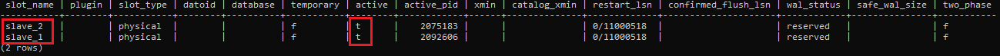

# Cài đặt và Cấu hình Replication trên PostgreSQL

Hướng dẫn này mô tả cách thiết lập **asynchronous streaming replication** với 1 master và 2 slaves trên PostgreSQL phiên bản 14.

## Yêu cầu
- PostgreSQL cài trên cả 3 node (master, slave_1, slave_2):
  + Địa chỉ ip master: 192.168.110.31
  + Địa chỉ ip slave_1: 192.168.110.32
  + Địa chỉ ip slave_2: 192.168.110.164
- Mở port 5432 trên firewall.
- Kết nối mạng giữa các node hoạt động tốt.

---
## 1. CÀI ĐẶT
**Mặc định khi cài đặt Postgresql qua package manager sẽ tạo user postgres trên hệ thống để thao tác với Postgresql**
### 1.1. Trên node master (192.168.110.31)
- Cập nhật các gói:
    ```
    sudo apt update
    ```
- Cài đặt Postgresql 14:
    ```
    sudo apt install postgresql-14
    ```
- Khởi động Postgresql:
    ```
    sudo systemctl start postgresql
    ```
- Bật tự động khởi động Postgresql cùng hệ thống:
    ```
    sudo systemctl enable postgresql
    ```
- Kiểm tra Postgresql đã hoạt động chưa:
    ```
    sudo systemctl status postgresql
    ```
    Nếu thấy hiển thị kết quả `Active: active` thì tức là Postgresql đã khởi động thành công:
    ```
    postgresql.service - PostgreSQL RDBMS
        Loaded: loaded (/lib/systemd/system/postgresql.service; enabled; vendor preset: enabled)
        Active: active (exited) since Tue 2025-04-29 10:15:38 +07; 1h 0min ago
        Process: 3291748 ExecStart=/bin/true (code=exited, status=0/SUCCESS)
        Main PID: 3291748 (code=exited, status=0/SUCCESS)
        CPU: 846us

        10:15:38 nguyen-long systemd[1]: Starting PostgreSQL RDBMS...
        10:15:38 nguyen-long systemd[1]: Finished PostgreSQL RDBMS.
    ```
### 1.2. Trên node slave (192.168.110.32 và 192.168.110.164)
Thực hiện tương tự như ở node master

---

## 2. CẤU HÌNH REPLICATION
### Bước 1: Cấu hình Master
#### 1.1. Stop Master
```bash
sudo systemctl stop postgresql
```
#### 1.2. Chỉnh sửa `postgresql.conf`
- File cấu hình thường nằm ở vị trí `/etc/postgresql/14/main/postgresql.conf` hoặc bạn có thể show file config bằng cách query `SHOW config_file;`:
    ```bash
    $ su postgres
    [postgres]$ psql
    ```
    ```sql
    postgres=# SHOW config_file;
    ```
    Trong đó `su postgres` để chuyển sang user postgres. `psql` để truy cập postgresql cli, `SHOW config_file` để query lấy path config. Kết quả sẽ hiển thị ra path file `postgresql.conf`, ví dụ:
    ```sql
    postgres=# SHOW config_file;
               config_file
    -----------------------------------------
    /etc/postgresql/14/main/postgresql.conf
    (1 row)
    ```
    Sau đó exit khỏi postgresql cli bằng lệnh `\q`
- Cấu hình file `postgresql.conf` các giá trị sau:
  ```bash
  wal_level = replica
  max_wal_senders = 10
  max_replication_slots = 10
  wal_keep_size = 256
  listen_addresses = '*'
  max_connections = 1000
  ```
  Trong đó:

  + `wal_level = replica`: Xác định mức độ chi tiết thông tin được Master ghi vào WAL, mức này ghi nhiều thông tin hơn minimal nhưng ít hơn logical (mức cần cho logical replication/decoding).
  + `max_wal_senders = 10`: Đặt số lượng tối đa các tiến trình gửi WAL (WAL sender process) có thể chạy đồng thời. Các tiến trình này chịu trách nhiệm truyền (stream) dữ liệu WAL từ máy chủ chính này đến các máy chủ standby.
  + `max_replication_slots = 10`: Đặt số lượng tối đa các replication slot mà máy chủ có thể quản lý. Replication slot đảm bảo rằng máy chủ chính sẽ không xóa các file WAL mà một máy chủ standby cụ thể (đang sử dụng slot đó) vẫn cần, ngay cả khi standby bị ngắt kết nối tạm thời. Điều này ngăn chặn việc standby không thể tiếp tục đồng bộ do thiếu file WAL trên primary.
  + `wal_keep_size = 256`: Chỉ định dung lượng tối thiểu của các file WAL cũ sẽ được giữ lại trong thư mục pg_wal ngay cả khi không có standby nào cần chúng. Cung cấp một vùng đệm an toàn cho các standby không sử dụng replication slot. Nếu standby bị chậm lại, nó vẫn có cơ hội tìm thấy file WAL cần thiết nếu chúng nằm trong giới hạn 256MB này.
  + `listen_addresses = '*'`: Lắng nghe trên tất cả các địa chỉ IP (cả IPv4 và IPv6) có sẵn trên máy chủ.
  + `max_connections = 1000`: Đặt số lượng tối đa các kết nối client đồng thời được phép kết nối tới máy chủ PostgreSQL.

#### 1.3. Chỉnh sửa `pg_hba.conf`
- File cấu hình thường nằm ở vị trí `/etc/postgresql/14/main/pg_hba.conf` hoặc bạn có thể show file config bằng cách query `SHOW config_file;`:
    ```bash
    $ su postgres
    [postgres]$ psql
    ```
    ```sql
    postgres=# SHOW hba_file;
    ```
    Trong đó `su postgres` để chuyển sang user postgres. `psql` để truy cập postgresql cli, `SHOW hba_file` để query lấy path config. Kết quả sẽ hiển thị ra path file config, ví dụ:
    ```sql
    postgres=# SHOW hba_file;
              hba_file
    -------------------------------------
    /etc/postgresql/14/main/pg_hba.conf
    (1 row)
    ```
    Sau đó exit khỏi postgresql cli bằng lệnh `\q`
- Cấu hình file `pg_hba.conf` thêm hai dòng sau:
  ```bash
  host    replication     replicator    192.168.110.32/24    md5
  host    replication     replicator    192.168.110.164/24   md5
  ```
    Lưu ý thay địa chỉ ip bằng địa chỉ ip các node Slave của bạn
#### 1.4. Tạo user replication
- Trên Master, truy cập vào postgresql cli chạy lệnh tạo user replicator với quyền replication:
  ```sql
  CREATE ROLE replicator WITH REPLICATION LOGIN PASSWORD 'your_secure_password';
  ```
  Trong đó:
  - `replicator` là tên người dùng
  - `your_secure_password` là mật khẩu của người dùng `replicator` bạn muốn đặt
  - `REPLICATION` chỉ định quyền sao chép cho user replicator, cho phép người dùng tham gia vào việc sao chép dữ liệu từ máy chủ Postgresql chính (Master) sang các máy chủ Postgresql khác (Standby) để đảm bảo tính sẵn sàng vào sao lưu dự phòng.

#### 1.5. Khởi động lại Master
```bash
sudo systemctl restart postgresql
```

---

### Bước 2: Cấu hình Slave (Slave_1: 192.168.110.32 và Slave_2: 192.168.110.164)

#### 2.1 Sao chép dữ liệu từ Master
**Thực hiện trên cả 2 Slave lần lượt các bước sau:**
##### 2.1.1. Dừng Postgresql:
   ```bash
   sudo systemctl stop postgresql
   ```
##### 2.1.2. Xóa dữ liệu cũ:
   ```bash
   sudo rm -rf /var/lib/postgresql/14/main/*
   ```
##### 2.1.3. Sao chép dữ liệu:
   ```bash
   sudo -u postgres pg_basebackup -h 192.168.110.31 -D /var/lib/postgresql/14/main -U replicator -P --wal-method=stream
   ```

#### 2.2 Chỉnh sửa `postgresql.conf`
##### 2.2.1. Trên Slave_1:
- File: `/etc/postgresql/14/main/postgresql.conf`
- Cấu hình:
  ```
  hot_standby = on
  primary_conninfo = 'host=192.168.110.31 port=5432 user=replicator password=your_secure_password application_name=slave_1'
  primary_slot_name = 'slave_1'
  max_connections = 1000
  ```
    Lưu ý thay địa chỉ ip host Master của bạn và điền password bạn đã đặt vào phần `your_secure_password`
##### 2.2.2. Trên Slave_2:
- File: `/etc/postgresql/14/main/postgresql.conf`
- Cấu hình:
  ```
  hot_standby = on
  primary_conninfo = 'host=192.168.110.31 port=5432 user=replicator password=your_secure_password application_name=slave_2'
  primary_slot_name = 'slave_2'
  max_connections = 1000
  ```
    **Lưu ý điền password bạn đã đặt vào phần** `your_secure_password`

#### 2.3 Tạo file `standby.signal`
Thực hiện tạo file trên cả 2 Slave:
```bash
sudo -u postgres touch /var/lib/postgresql/14/main/standby.signal
```

#### 2.4 Khởi động Slave_1 và Slave_2
```bash
sudo systemctl start postgresql
```

---

## 3. KIỂM TRA REPLICATION

### 3.1. Trên Master
- Kiểm tra slots:
  ```sql
  SELECT * FROM pg_replication_slots;
  ```
  Nếu kết quả trả về cột slot_name có 2 Slave và cột active trạng thái là t và một số cột thông tin khác thì tức là đã thiết lập thành công:


<p align="center">Check replication slots</p>

- Kiểm tra trạng thái:
  ```sql
  SELECT * FROM pg_stat_replication;
  ```
    Lệnh này trả về bảng kết quả gồm một số cột trạng thái:

    | Cột               | Ý nghĩa                                                               |
    |-------------------|----------------------------------------------------------------------------------|
    | `pid`             | ID tiến trình walsender trên master.                                             |
    | `usesysid`        | ID người dùng của tiến trình walsender.                                          |
    | `usename`         | Tên người dùng của tiến trình walsender.                                         |
    | `application_name`| Tên ứng dụng/slave khi kết nối.                                                  |
    | `client_addr`     | IP của slave.                                                                    |
    | `client_hostname` | Tên máy chủ của slave (có thể trống).                                            |
    | `client_port`     | Cổng kết nối của slave.                                                          |
    | `backend_start`   | Thời điểm walsender khởi động.                                                   |
    | `backend_xmin`    | Xmin sớm nhất cần giữ trên master (tránh bloat).                                 |
    | `state`           | Trạng thái kết nối (ví dụ: `streaming`).                                        |
    | `sent_lsn`        | LSN cuối cùng master đã gửi.                                                     |
    | `write_lsn`       | LSN cuối cùng walsender đã ghi vào socket gửi.                                   |
    | `flush_lsn`       | LSN cuối cùng master nhận xác nhận đã ghi từ slave.                              |
    | `replay_lsn`      | LSN cuối cùng slave đã áp dụng.                                                  |
    | `write_lag`       | Độ trễ ghi WAL vào socket gửi.                                                   |
    | `flush_lag`       | Độ trễ nhận xác nhận ghi từ slave.                                               |
    | `replay_lag`      | Độ trễ áp dụng WAL trên slave.                                                   |
    | `sync_priority`   | Mức độ ưu tiên đồng bộ (cho synchronous replication).                            |
    | `sync_state`      | Trạng thái đồng bộ (`async` hoặc `sync`).                                        |
    | `reply_time`      | Thời điểm cuối cùng master nhận phản hồi từ slave.                               |

- Tạo bảng, Insert dữ liệu:
    ```sql
    postgres=# CREATE TABLE users (
        id SERIAL PRIMARY KEY,
        name VARCHAR(100)
    );
    postgres=# INSERT INTO users (name) VALUES ('Nguyen Hai Long'); 
    postgres=# INSERT INTO users (name) VALUES ('Hoang Duc Canh');
    ```

### 3.2. Trên Slave
- Kiểm tra chế độ recovery:
  ```sql
  postgres=# SELECT pg_is_in_recovery();
    pg_is_in_recovery
    -------------------
    t
    (1 row)
  ```
- Select dữ liệu từ bảng `users`:
    ```sql
    postgres=# select * from users;
    id |      name
    ----+-----------------
    1 | Nguyen Hai Long
    2 | Hoang Duc Canh
    (2 rows)
    ```
- Thử Insert dữ liệu từ Slave:
    ```sql
    postgres=# insert into users (name) values ('nguyen chi thanh');
    ERROR:  cannot execute INSERT in a read-only transaction
    ```
    Kết quả lỗi vì chỉ Master mới có quyền write, Slave chỉ có quyền đọc dữ liệu
---

## Lưu ý
- Theo dõi log: `/var/log/postgresql/postgresql-14-main.log` để xác định lỗi của từng node trong cụm khi có sự cố.
- Đảm bảo `max_connections` trên slave >= master.

---

**Vậy là replication đã được thiết lập thành công!**